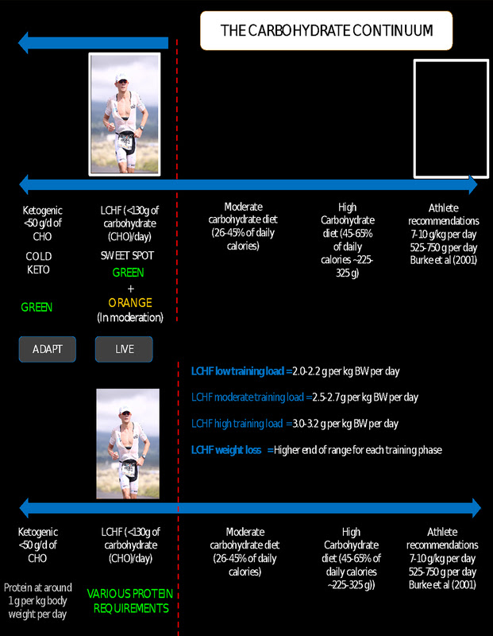
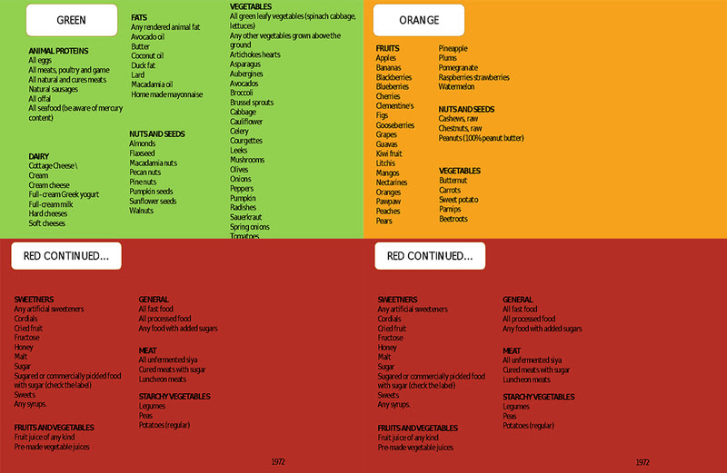

## Achievements (what went wrong)
So I completed the [Rotterdam Marathon](https://www.strava.com/activities/2272071331), but it didn't go as planned. I identified the following reasons:
- it was a lot warmer (close to 23 Celcius) than was anticipated.
- the heat also came a lot quicker than anticipated (almost from the start instead of after 13:00 hrs)
- the course was very crowded (close to 17K people signed up for the marathon and just of 14K started or finished)
- overtaking many people cost/takes a lot of energy
- started in wave 4 (out of 5), but almost at the front
- the course is very narrow in a lot of places, not easy to overtake
- started to quick (yep rookie/beginner mistake) with 5:00min/km or faster instead of the 5:12min/km
- blister on right little tow (more an inconvenience than a problem)
- running shoes became to tight due to swelling of feet (too much water, maybe or just the heat)
- no hat or cap 
- muscle aches upper legs, took an Aleeve (painkiller) on 30KM 
- drank an AA-drink recovery (shouldn't have done that :-)) after the race
- had a banana after the race

## Takeaways for the next race
For the next marathon/race:
- [ ] stick with the pace
- [ ] negative split
- [ ] no stopping
- [ ] take Aleeve before the start
- [ ] UCAN in training for some lond distances or as recovery option
- [ ] follow the Plewes/Taren LCHF plan 

## The Plan
The idea was to run the Rotterdam Marathon without a large amount of carb. Most the training that I have done was fasted (if the running was in the morning) and with some carbs if it was in the afternoon/evening.
The goal is to run the marathon:
- [ ] without stopping
- [x] without carb loading (no pasta party for me :-))
- [x] using [Generation UCAN](https://www.generationucan.com/)
- [x] using [Ultra Salt](http://www.purevitaminclub.com) (before and during)  
- [x] using ["Sport Rusten 100 dagen"](https://www.sportrusten.nl/sportrusten-schema-voor-de-marathon/) training
- [x] using ["Sport Rusten breathing"](https://www.sportrusten.nl/kennisbank/test-zelf-je-ademhaling/)
- [ ] with a pace of 5:12.00 per kilometer (or [08:22.00 mile](http://www.bane.info))
- [x] with only drinking water
- [x] while wearing the [The North Face Ultra Cardiac II Trail Shoes](https://www.thenorthface.com/shop/mens-ultra-cardiac-ii-nf0a2vuv?variationId=WU5#hero=0)
- [x] while wearing the [HUUB ACTIVE SOCK - WHITE](https://huubdesign.com/products/huub-active-sock-white)
- [x] while wearing the [huub-core-triathlon-suit](https://huubdesign.com/collections/triathlon-suits/products/huub-core-triathlon-suit-sleeved-mens-black-red?variant=22380811783)
- [x] using the [garmin fenix 5](https://buy.garmin.com/en-US/US/p/552982/pn/010-01688-00)
- [x] using the [garmin hrm-tri](https://buy.garmin.com/en-US/US/p/pn/010-10997-09)
- [x] using the [salomon fueling belt](https://www.salomon.com/en-us/shop/product/agile-500-belt-set.html#1191=9594)
- [x] using  [Project Rudy Rydon sun glasses](https://www.rudyproject.com/ww/en/products/performance-eyewear/rydon.html)
- [x] using [arm extentions from columbia](https://www.columbia.com/freezer-zero-arm-sleeves-SU9090.html?cgid=activity-trailrunning-accessories#start=1)
- [ ] using OOFOS slippers
